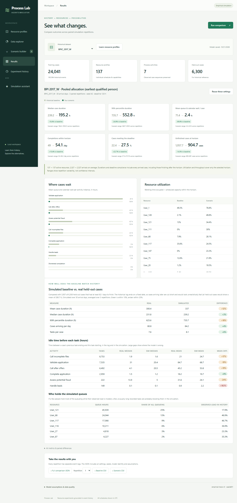
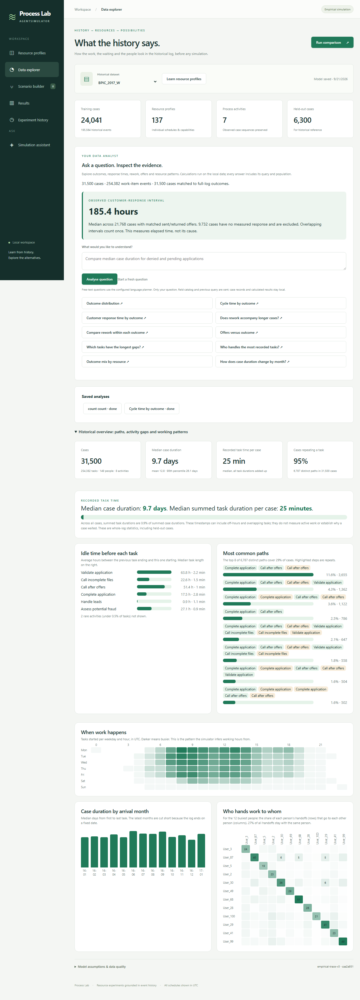
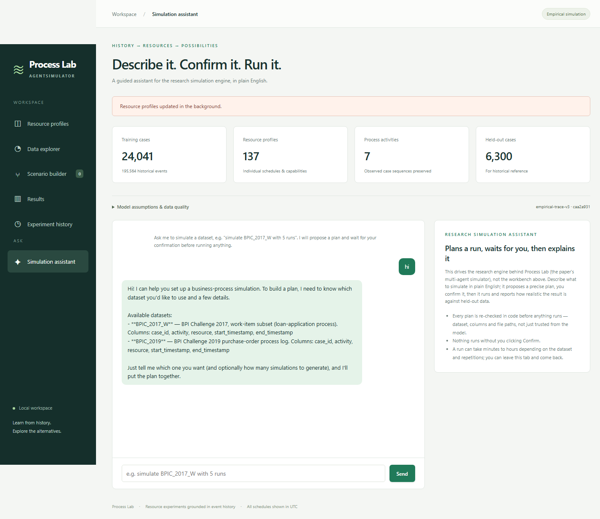

# Process Lab / AgentSimulator

[](https://github.com/Saikrishna020/Process_Simulator-Agent/actions/workflows/ci.yml)

**Learn how an organisation really works from its event log — then simulate "what if?" and
see which changes actually matter.**







## What I found (BPI Challenge 2017, 31,500 loan applications, 149 people)

1. **A typical case takes 9.7 days but needs only ~25 minutes of hands-on work** — 0.9% of
   elapsed time. The rest is waiting.
2. **Most waiting is not a staffing problem.** About 78% of simulated cycle time is external
   delay (customer callbacks, documents); ~21% is queueing; processing is ~1%.
3. **Adding or removing people barely moves cycle time.** Removing the busiest person: −0.2%.
   Adding three copies of them: −0.2%. Halving all external delays: **−37%**.
4. **How work is allocated does matter.** Sending each task to the earliest available qualified
   person, instead of the historically preferred one, cuts queue wait by 96% (61 h → 2 h) and
   cycle time by ~18%. This is an upper bound: the log cannot show real skill or approval limits.
5. **A third of cases are customer cancellations, and those are the slow ones.** 33% of cases end
   in cancellation with a median cycle time of 31.6 days — more than double approved (14.8) or
   denied (14.1) cases. The median wait for a customer to respond to a loan offer is 185 hours
   (~7.7 days), which likely accounts for much of the "residual delay" the simulator can't explain.

Full analysis, numbers and reproduction steps: **[PROJECT_GUIDE.md](PROJECT_GUIDE.md)**. Ask these
questions yourself in **Data Explorer → Data Analyst** — the same findings, computed live from the
full log, no AI key required for the preset questions.

## Honest limitations

- **Not a forecast.** Every result shows the simulated baseline against real held-out cases that
  had time to finish: +12% mean, +3% median, +18% at the tail. Most of the remaining overshoot traces
  to 0.1% of recorded task durations (up to 531 working hours, probably items left open) that block
  people for weeks in the simulation; capping them brings the gap to about -3%. Use it to *compare*
  scenarios, not to predict days. Evidence: [WORKBENCH.md](WORKBENCH.md).
- One task at a time per resource (15% of real work items overlap), no batching or fatigue.
- Working hours are inferred from observed activity and shown in UTC.
- Cloning a person copies the original's behaviour; a real new hire would differ.
- Residual delay is a leftover, not a diagnosed cause.

## Try it

```powershell
cd AgentSimulator
./start-workbench.ps1          # Process Lab at http://127.0.0.1:8000, no API key needed
```

Pick **BPIC_2017_W** → **Learn resource profiles** → look around the **Data explorer**, which opens
into a data analyst: ask a plain-English question or click a preset (outcome distribution, rework
vs. cycle time, offers vs. outcome, resource-outcome mix...) and get a computed answer with its
query, sample size and caveats, not a canned chart → open **Scenario builder** and start from a
preset (pooled allocation, halve delays, remove the busiest person, demand +50%). Each run
compares a paired baseline and scenario and saves settings, seeds and downloadable event logs.
Or click **Simulation assistant** in the sidebar and just describe what you want in plain English
— it plans a run of the research engine, waits for your confirmation, then reports how realistic
the result is. Same app, same page, one design — not a separate tool bolted on the side.
See [WORKBENCH.md](WORKBENCH.md) for the method, assumptions, API, and a write-up of a bug caught
by sanity-checking the model against held-out data.

## What is in this repo

| Part | What it does | LLM key? |
| --- | --- | --- |
| **Process Lab** (`webapp/workbench/`, tabs "Resource profiles" → "Experiment history") | Learns resource profiles from history, runs paired baseline/scenario comparisons. Empirical trace-resampling engine, inspectable and fast (~10 s per comparison). | No |
| **Research engine** (`source/`, `simulate.py`) | Multi-agent simulator from the AgentSimulator paper; each resource is an agent. Scored against held-out data with five distance metrics (`evaluate_run.py`). | No |
| **Simulation assistant** (`webapp/orchestrator/`, the "Simulation assistant" tab) | LangGraph + DeepSeek agent that turns "simulate BPIC_2017_W with 3 runs" into a validated, human-confirmed run of the research engine. Same page, same design as Process Lab. See [ORCHESTRATOR.md](ORCHESTRATOR.md). | Yes |

All three share one FastAPI app and one page (`webapp/main.py`, `webapp/static/workbench.*`) — there
is no separate chat UI to keep visually in sync; `/chat` is kept only as a redirect for old links.

Research engine scores (10 simulations, lower is better) — BPI 2017 is comparable to the paper on
control-flow but ~3× worse on cycle-time distance (different log extraction, see the guide). LoanApp
is a small synthetic log kept only as a fast, deterministic fixture for the test suite (not offered
in the product — real data tells a better story) and reproduces the paper closely:

| Log | NGD | AEDD | CEDD | REDD | CTDD |
| --- | --- | --- | --- | --- | --- |
| LoanApp (this repo / paper) — internal test fixture | 0.080 / 0.07 | 2.97 / 2.78 | 0.221 / 0.21 | 1.38 / 1.34 | 1.60 / 1.49 |
| BPI 2017 W (this repo / paper) | 0.225 / 0.30 | 234.6 / 221 | 2.37 / 1.64 | 66.9 / 26.0 | 69.8 / 22.8 |

## Engineering notes

- Temporal 80/20 split, paired random numbers, an unchanged scenario reproduces the baseline exactly.
- Typed, strictly validated requests; immutable content-hashed models; one bounded background job
  worker with crash recovery; nothing is overwritten.
- The chat agent never executes anything the LLM proposes directly: schema validation, path
  containment, human confirmation, no shell, bounded retries/timeouts.
- Regression tests (`python -m pytest`), run by GitHub Actions on every push, including a full LoanApp run of the research engine. Local browser checks also cover explorer and chat recovery; see [WORKBENCH.md](WORKBENCH.md).
- Data: `raw_data/` is not tracked (BPI logs are large). Convert the public BPI 2017 XES with
  `raw_data/xes_to_csv.py --w-only`. BPI 2019 is listed but disabled in the Lab because its
  export has only zero-duration events.

## Credits

The simulation engine (`source/`, `simulate.py`) builds on **AgentSimulator**, the supplementary
code for *"AgentSimulator: An Agent-based Approach for Data-driven Business Process Simulation"*
by Lukas Kirchdorfer, Robert Blümel, Timotheus Kampik, Han van der Aa and Heiner Stuckenschmidt
([arXiv 2408.08571](https://arxiv.org/abs/2408.08571)). Process Lab, the chat agent, guardrails,
and the web layer are built on top of that engine.

MIT licensed — see [LICENSE](LICENSE).
